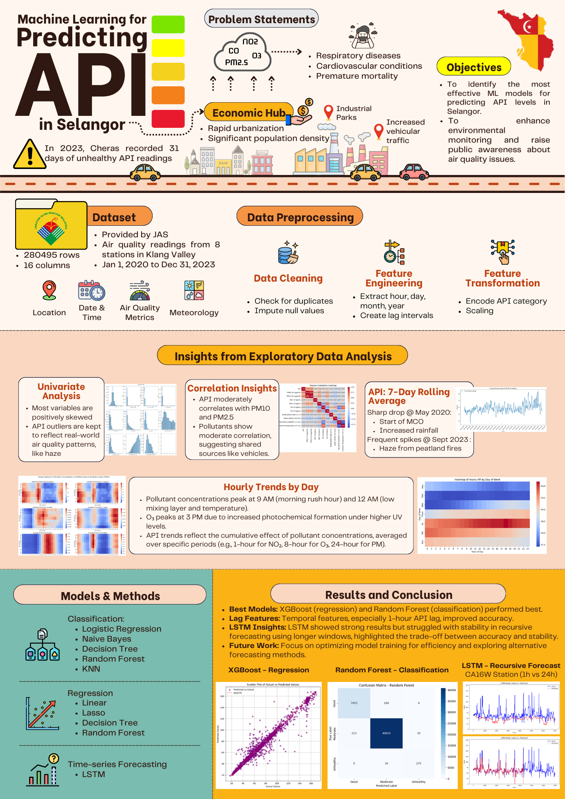
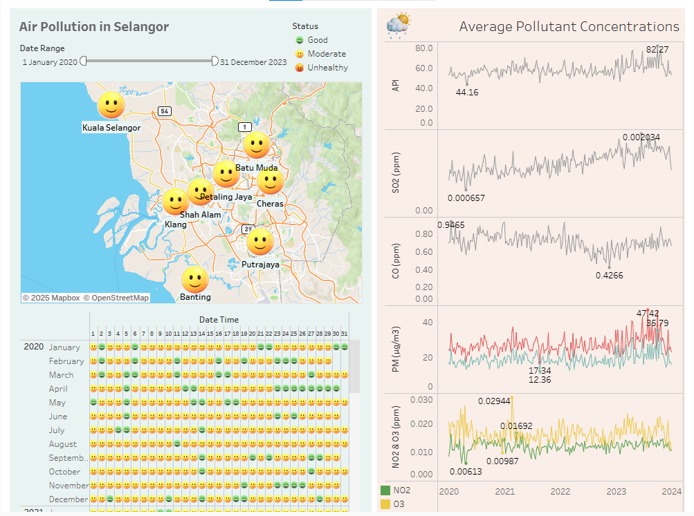

# Selangor Air Pollution Index (API) Prediction : Project Overview 
This project predicts the API level in Selangor using various machine learning models to provide early warnings about harmful air pollutants
- Collected and processed air quality data from Jabatan Alam Sekitar (JAS)
- Applied and fine-tuned multiple ML algorithms (XGBoost, Random Forest, Decision Trees, etc.) using GridSearchCV for both regression and classification
- Trained LSTM models for station-wise time series forecasting

## Code and Resources Used 
**Python Version:** 3.11.9  
**Packages:** pydotplus, six, ydata-profiling, scikit-learn, tensorflow, xgboost, graphviz 
**For Package Requirements:**  ```pip install -r requirements.txt```  
**Data Set Source:** Jabatan Alam Sekitar (JAS) 

## Key Findings and Results

The key findings and results of this project are summarized in the following poster.
[](poster.pdf)


## Tableau
A public dashboard was created in [Tableau](https://public.tableau.com/views/API_Selangor/Dashboard1?:language=en-GB&:sid=&:redirect=auth&:display_count=n&:origin=viz_share_link) for high-level data exploration.
[](https://public.tableau.com/views/API_Selangor/Dashboard1?:language=en-GB&:sid=&:redirect=auth&:display_count=n&:origin=viz_share_link)

## Model Performance Overview
### Regression and Classification Models
Lag features, especially 1-hour API lag, significantly improved model performance in both regression and classification tasks.

- Regression (XGBoost): R² improved from 0.356 to more than 0.98 while RMSE dropped from 10.2 to 1.62

- Classification (Random Forest): MCC improved from 0.20 to 0.96

Historical API values were consistently more predictive than current pollutant and weather data, highlighting the importance of temporal dependencies.

### LSTM models
Station-specific LSTM models were trained using 1-hour and 24-hour windows.

- Autoregressive forecasting consistently yielded lower RMSE and MAE.
- Recursive forecasting:
    - 1-hour window: High errors due to limited context.
    - 24-hour window: Better accuracy, but unstable as errors accumulated over time, leading to NaNs or infinity.

Autoregressive forecasting is more stable and accurate. Recursive forecasting benefits from longer windows but risks instability.

### Future Work
Future studies could focus on:
- Improving the efficiency of model training and cross-validation to reduce time, especially with large datasets.
- Exploring other forecasting techniques to handle temporal dependencies, particularly addressing the instability issues seen with longer time windows in LSTM models.
- Evaluating the models' generalizability across other geographic regions or pollutants.

## 📦 Storage
Due to size limitations, some Random Forest models files are hosted externally on One Drive:

- Regression (No Lag Features) — [Download](https://1drv.ms/u/s!Atv8uviDqvPhiuANCk_BnYX04dCoDQ?e=vmaP80)
- Regression (With Lag Features) — [Download](https://1drv.ms/u/s!Atv8uviDqvPhiuAxqmpgXQf33p6Ksg?e=nclRSn)
- Classification (No Lag Features) — [Download](https://1drv.ms/u/s!Atv8uviDqvPhiuAZoVoQKH4gXA_LKg?e=nkTSAy)


## Project Organization
```
├── README.md          <- Project Overview
├── data
│   ├── interim        <- Intermediate data that has been transformed
│   ├── processed      <- The final, canonical data sets for modeling
│   └── raw            <- The original, immutable data dump
│
├── models             <- Trained and serialized models, model predictions, or model summaries
│   ├── classification 
│   ├── lstm           
│   └── regression
│
├── notebooks          <- Jupyter notebooks. Naming convention is a number (for ordering),
│                         and a short `-` delimited description, e.g.
│                         `1.0-initial-data-exploration`
│
├── reports            <- Generated analysis and results as HTML, PDF, LaTeX, CSV etc.
│   ├── classification <- Generated graphics and figures from evaluation of classification models
│   ├── eda            <- Generated graphics and figures from EDA
│   └── classification <- Generated metric values during evaluation of regression models
│
└──  requirements.txt  <- The requirements file for reproducing the analysis environment, 
                           e.g. generated with `pip freeze > requirements.txt`

```

--------